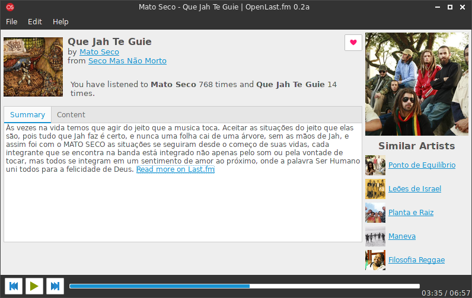

# OpenScrobbler
> Last.fm client written in Java + Gtk 3.0 with MPD support.

OpenScrobbler is a alternative for the last.fm desktop client to Linux systems. 

## Meta

Felipe Marinho – [felipevm97@gmail.com]()

Distributed under the GPLv3 license. See ``LICENSE`` for more information.

[https://github.com/FelipeMarinho97/open-scrobbler](https://github.com/FelipeMarinho97/)

## Contributing

1. Fork it (<https://github.com/FelipeMarinho97/open-scrobbler/fork>)
2. Create your feature branch (`git checkout -b feature/fooBar`)
3. Commit your changes (`git commit -am 'Add some fooBar'`)
4. Push to the branch (`git push origin feature/fooBar`)
5. Create a new Pull Request
